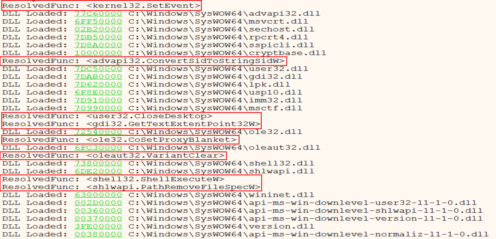
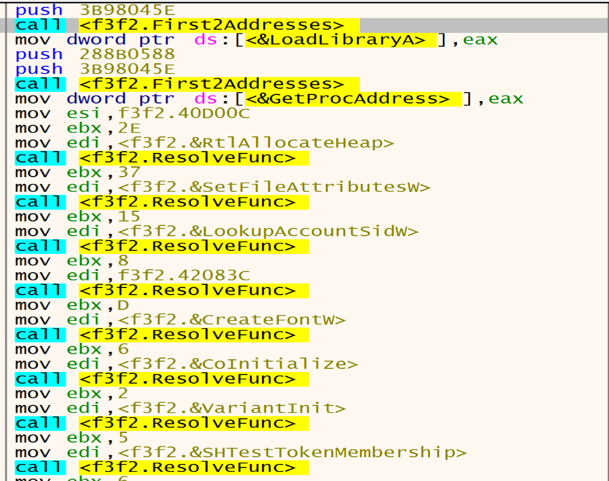
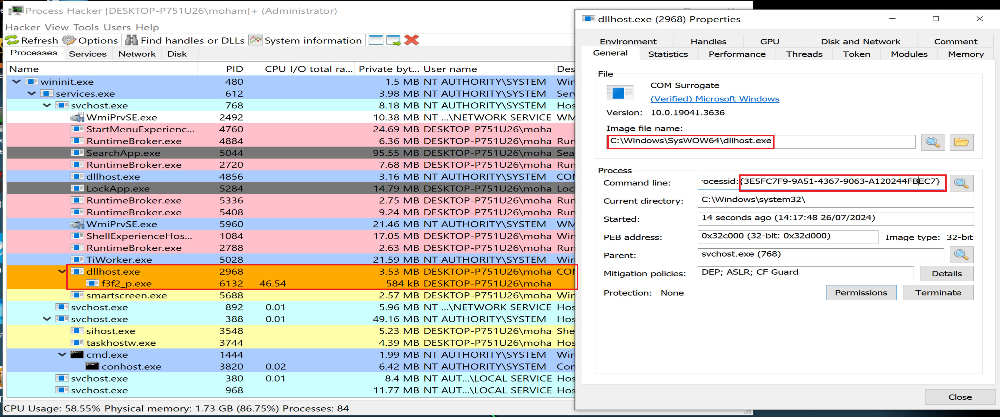

# DarkSide_Ransomware Analysis

## Summary

DarkSide ransomware is a sophisticated cyber threat that emerged in August 2020, targeting large organizations with double extortion tactics encrypting data and threatening to publish stolen information if the ransom is not paid. Known for its Ransomware-as-a-Service model, it gained notoriety for the high profile attack on Colonial Pipeline in May 2021, causing significant fuel supply disruptions in the U.S. Despite shutting down operations after this incident, DarkSide is believed to have rebranded and continues to pose a significant cybersecurity threat.

## Basic Analysis

## Advanced Analysis

After opening the sample in IDA, we will notice that the start point wil call only 3 functions.

If we open them one after one, we will find that the first function doing some calculation.

If we look in second function we will notice that the Malware will access `PEB` structure and to get some thing from it.

According to this [Article](https://www.aldeid.com/wiki/PEB-Process-Environment-Block) we can get informations about the offsets that the malware will get from the PEB.

18h => `ProcessHeap`

8h => `ImageBaseAddress`

64h => `NumberOfProcessors`

10h => `RTL_USER_PROCESS_PARAMETERS* ProcessParameters`

- `RTL_USER_PROCESS_PARAMETERS` structure plays a crucial role in Windows processes. It encapsulates various arguments and parameters that can be specified for Win32 API functions like CreateProcess. Let’s break down its key components:

- 3ch => `ImagePathName`:
This field holds the path to the executable image file associated with the process.
For example, it might point to C:\Windows\System32\cmd.exe.

- 44h=> `CommandLine`:
The CommandLine field contains the command-line string passed to the process.
It includes any arguments provided when launching the process.

If we look in third function we will see a lot of calculations and nested calls and the function calls `dwords` in data section. so, Malware surely replces these dwords with APIs in run time period.

After loading the sample into X32 debugger we will see that the first function doing some calculation, but I can’t understand what their functionality.

By Entering in the second function, we can understand what it does by looking at the documentation of `PEB` and debug it to see the results to confirm from our static analysis that we made it above.

Third function has a lot of details and calls so, I will  make an analysis it.

### Resolving Windows APIs at Run Time

---
After getitng in the first call in the third function we will notice that th function `401820` called Twice and function `4018D9` called many times.

Inside the function `401820` we will see the `PEB Structure` again.

But now it get their informations from offset `0Ch` `2Ch` and we can get informations about their two offsets from this [Article](https://www.geoffchappell.com/studies/windows/km/ntoskrnl/inc/api/pebteb/peb/index.htm)

 0Ch >= `PEB_LDR_DATA`

- The [PEB_LDR_DATA](http://sandsprite.com/CodeStuff/Understanding_the_Peb_Loader_Data_List.html) structure is a Windows Operating System structure that contains information about all of the loaded modules in the current process,  It’s essentially the head of a doubly-linked list, and each item in the list points to an LDR_DATA_TABLE_ENTRY structure, which represents a loaded module. The InMemoryOrderModuleList field within PEB_LDR_DATA holds this list of loaded modules, Which contains all information about each module in process memory.

2Ch >= `KernelCallbackTable`

- may be to load kernel APIs Table.

Malware firstly will go to `ntdll.dll` and `kernel32.dll` to reach to their exports table and then search about names of the functions that he need then he will take their addresses and store them in the dwords to start call them as API’s (Malware Resolving API’s at runtime).

Malware author made a hashing algorithm private to him and he stored it in local variable `[ebp+8]` starting to compare this hashes with hashes of the libraries and functions he need if the two hashes are equal he will not take the jump to exit from the function, He will keep his malicious activity keep going.

- in this figure malware will compare `ntdll.dll` hash with his own hash but it will not be matched so, the jump will be taken and he will exit from the function searching for another library to get the function he need from it.

Now malware compare the hash of `kernel32.dll` with his own hash and will be match to each other so, the jump will not be taken and he will start to bring the functions he need from it.

Now he will dive into `Kernel32.dll` and starting to search about functions he need by comparing hashes, in the figure below malware will compare the hash of the first function in kernel32 called `AcquireSRWLockExclusive` and it will not be matched so, the malware will loop on all imports in KERNEL32 to get the target API.

 And if we put a breakpoint after this jump  `jne darkside_ransomware.4018B3` we will see that the malware will get `LoadLibraryA`.

The second API malware will get it is `GetProcAddress` from `KERNEL32`.

So, by using `LoadLibraryA` and `GetProcAddress` malware can resolve any Windows API Function.

Inside the second function `4018D9` Malware starting to resolve APIs that he need and put it in `dwords` by calling `LoadLibraryA` and `GetProcAddress`.

And we can make a conditional break point in the function that make resolve to other APIs and we can see the log after this, and this figure shows some of them.

Second function gets APIs like `RtlAllocateHeap`,    `SetFileAttrrebutesW`, `LookupAccountSidW`, `GetDC`, `CreateFontW`, `CoInitialize`.....

### Determine The System Default UI Language

Malware trying to detect our system’s installed and default language by calling `ZwQueryInstallUILanguage` and `ZwQueryDefaultUILanguage`.

Then he will compare the letters of system’s default language with the letters of Russian language and if the language is not Russian malware will keep going in his malicious activity.

### Generate Ransomware Extension

Malware call `RtlAllocateHeap` API to allocate memory heap and store some thing encrypted in it.

By getting in the next function we will see that the malware will decrypt the encrypted string that he stored it in the memory heap above, and the decrypted string will be  `SOFTWARE\Microsoft\Cryptography`.

Here malware trying to open the Registry key called `SOFTWARE\Microsoft\Cryptography` by calling `RegCreateKeyExW`.

Malware will allocate memory and decoded another string `MachineGuid` so, we will make a conditional break point at return function to store all the decoded strings in the log to be easy to us.

After opening the Registry malware will get the `MachineGuid` from it by calling `RegQueryvalueExW` API.

`memcpy` has two arguments Destinstion and the source in this figure the Unique Identifier(Guid) has been sent from the register `Eax` to `[ebp+8]` and the result will be "93278b6e-93a3-40e1-bfb7-b6dfda52ac11"

- The MachineGuid is an identifier stored in the Windows registry. It’s generated during Windows installation and is unique to each machine. we can retrieve it from the registry using the path: HKEY_LOCAL_MACHINE\SOFTWARE\Microsoft\Cryptography\MachineGuid

Malware will make a lot of calculation on Guid to get somthing.

After a lot of calculation on Guid malware wants to get the result with only 8 in hex so, now we have the Extension of this Ransomware `.cdbb3152`

The extension of encrypted files that are encrypted by this malware will be change dynamically based on the victim machine GUID.

### Privilege Escalation (UAC Bypass)

malware will dive in function called `00401F8A` and inside it we will see this function calls `SHTestTokenMembership` API by pushing two arguments `(220,0)`, we can know some details about this function from MSDN [SHTestTokenMembership](https://learn.microsoft.com/en-us/windows/win32/api/shellapi/nf-shellapi-shtesttokenmembership) this function Uses `CheckTokenMembership` to test whether the given token is a member of the local group with the specified RID, and we can read about it from here [CheckTokenMembership](https://learn.microsoft.com/en-us/windows/win32/api/securitybaseapi/nf-securitybaseapi-checktokenmembership)

So, malware uses SHTestTokenMembership API to verify if the user belongs to the Administrators groups (0x220 = 544 in decimal)

Then he starting to make a test to check if you are an admin or not if you are not EAX will be 0 else EAX will be 1

so, if we are not admin malware will get in the next function and will not take the jump to make a Privilege Escalation and bypass UAC to be an admin in our system.

So, lets look at the function called `If_NotAdmin` to see what is malware do.

Then Malware trying to get information from PEB by offsets:

A4 => `OSMajorVersion`

A8 => `OSMinorVersion`

Together, they provide information about the Windows version running the process so, Malware will continue his checks to see if you are an admin or not by get in the next function.

`NtOpenProcessToken` allows malware to open an access token associated with a process, while `ZwQueryInformationToken` retrieves specific information about an access token. Both functions are essential for working with security tokens in Windows applications and drivers.

Malware will initialize `COM` Object to achieve persistence and privilege escalation on our Windows systems.

Then malware will allocate memory and decode a string in it called `C:\\Windows\\System32`

Then malware will make some calculation on the encrypted text to decode it and the result will be `dllhost.exe`

By using functions like `wcscpy` and `wcscat` malware trying to copy one wide character string to another and It takes two arguments  the destination buffer (dest) and the source string (src).

So, it will copy the `dllhost.exe` to the path we are decrypted like this `C:\\Windows\\System32\\dllhost.exe`

Malware will run  `dllhost.exe`as admin then dllhost will run our malware again with higher privilege as admin.

After this malware will decode two strings:

- `Elevation:Administrator!new:`
- `{3E5FC7F9-9A51-4367-9063-A120244FBEC7}`  if we search about it we will find that is associated with a COM interface-object used for UAC (User Account Control) bypass. Several ransomware families exploit this technique to elevate their privileges and perform malicious actions without triggering UAC prompts.

And it will be as this shape `Elevation:Administrator!new{3E5FC7F9-9A51-4367-9063-A120244FBEC7}` after calling the two functions wcscpy and wcscat

After this malware will call function called `ObjectStublessClient9` to launch a new process with higher privilege as admin.

- Now we will continue with Dr Bahaa at Mahara Tech to start debug the new sample with new method to avoid the debugger escaping from me

After launching the new sample, debugger will stop at `TestTokenMemberShip` function wait us to start debug it, we will reach to the function called `LookupAccountSid` and it functionality is determining the account name and discover the domain where an account resides, malware usnig this function can impersonate legitimate users by obtaining their account names.
It can then perform actions (accessing files, running processes) with the same privileges as those users.

Malware now will decode strings like `NT AUTHORITY`, `AUTORITE NT`, `NT-AUTORITÄT` then will compare them with my account name by api `_wcsicmp` to see that I have a higher privilege or not.

Then malware will call `OpenSCManager` with this function he can control with any service in our machine because he has a higher privilege in our system after passing UAC.

Malware look for a sevice called `.cdbb3152` but he will not find it so, he will close this service handle.

Malware will open `OpenSCManager` again and will call `create service` that is take arguments like path of the Executable and service has the same name of the Extension to be ready to start this service.

after this the elevated process will exit so, we will make an analysis to a new sample has created with higher privilege than admin as a `NT AUTHORITY\SYSTEM` works as Sevice.

currently a new service called `.cdbb3152` running in our system with a new behavior

