# Darkside_Ransomware Analysis

## OverView

Darkside ransomware is a type of malicious software that encrypts data and demands a ransom for the decryption key. It primarily targets large organizations, using a double extortion technique where it not only encrypts files but also steals sensitive data, threatening to publish it unless the ransom is paid. The ransomware is highly customizable and operates on a ransomware-as-a-service (RaaS) model, allowing affiliates to use it in exchange for a share of the ransom payments. Notably, Darkside was responsible for the attack on Colonial Pipeline, which caused significant disruption. After this high-profile attack, the operators announced they were shutting down, but similar ransomware variants have since appeared.

## Basic Analysis

### File Hashes

SHA-256:
> F3F25AF554BEDFA4EE2824BB858280282BD87828D446048619DC49FE061741B4

SHA-1:
> C30358563FA940EB5CD6064D4D16DEFEE43B0310

MD5:
>3F2CB535FC5BC296AA5B0D2897C265D0


Using `VirusTotal` we will find 69/75 security vendors flagged this file as malicious.


File is compiled at `2021/04/05 Mon 22:09:09 UTC`


Using `CyberChef` we will find the file entropy is `6.8` but the file is not packed but he has a lot of encryption methods.


Malware will call 2 libraries named `KERNEL32.dll` and `ntdll.dll`.


Then malware will import 3 functions called `NtWriteVirtualMemory`, `NtReadVirtualMemory` and `ExitProcess` from previous libraries.


## Advanced Analysis

After opening the sample in IDA, we will see that the start point wil call only 3 functions.


If we open them one after one, we will find that the first function doing some calculation.


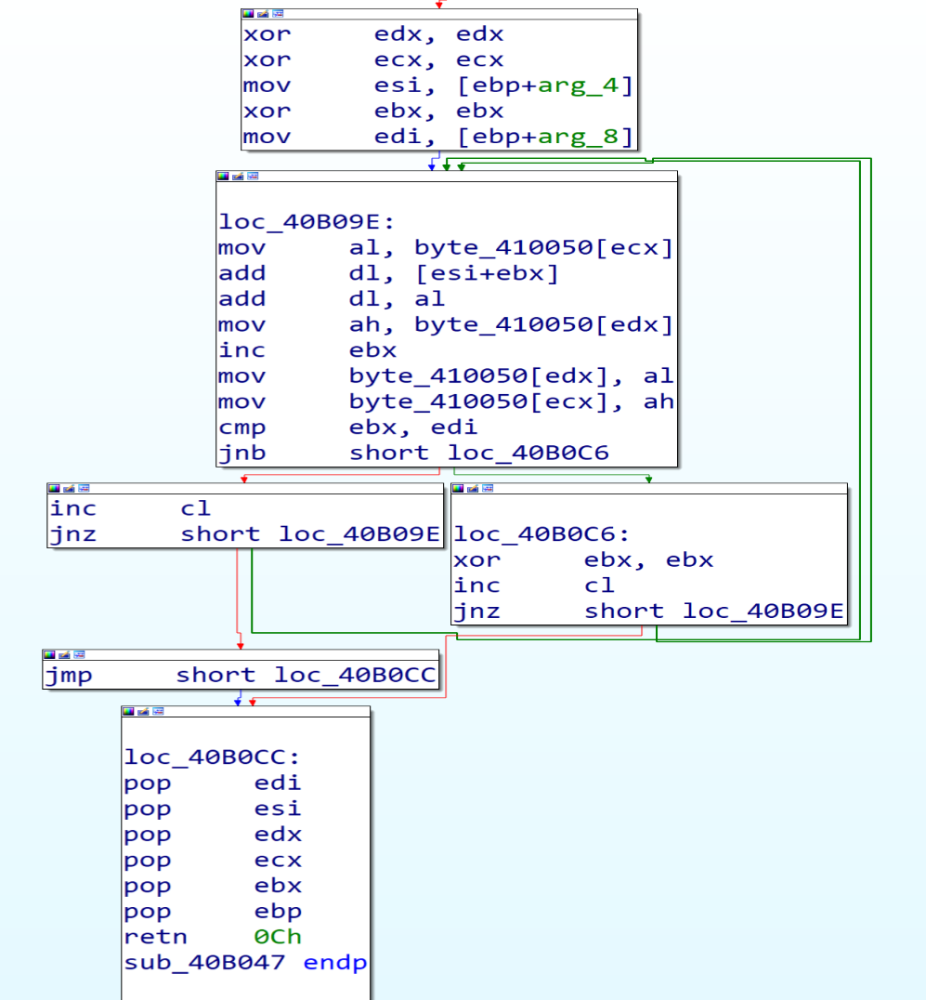

And if we look in the second function we will notice that the Malware will access `PEB` structure and will get some thing from it.

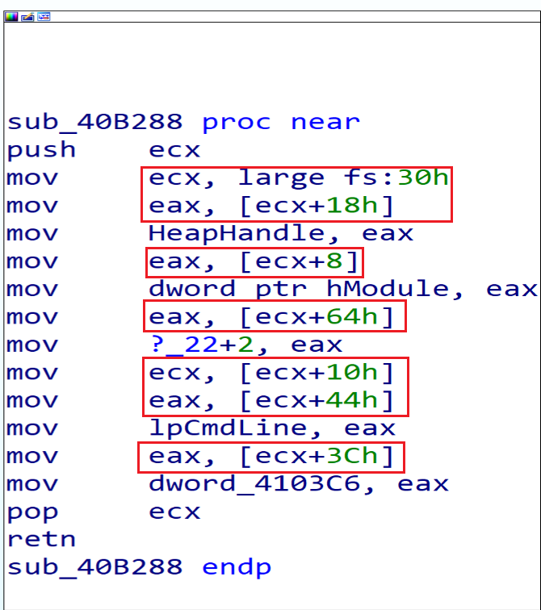

According to this [Article](https://www.aldeid.com/wiki/PEB-Process-Environment-Block) we can get some information about the offsets that the malware will get from the PEB.

18h => `ProcessHeap`

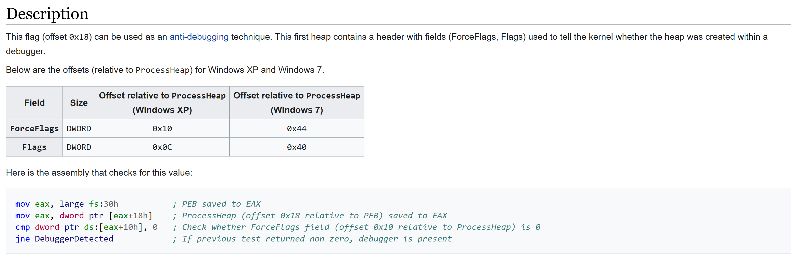

8h => `ImageBaseAddress`

64h => `NumberOfProcessors`

10h => `RTL_USER_PROCESS_PARAMETERS* ProcessParameters`

- `RTL_USER_PROCESS_PARAMETERS` structure plays a crucial role in Windows processes. It encapsulates various arguments and parameters that can be specified for Win32 API functions like CreateProcess. Let’s break down its key components:

- 3ch => `ImagePathName`:
This field holds the path to the executable image file associated with the process.
For example, it might point to C:\Windows\System32\cmd.exe.

- 44h=> `CommandLine`:
The CommandLine field contains the command-line string passed to the process.
It includes any arguments provided when launching the process.

Then if we look in the third function we will see a lot of calculations and nested calls, the function will  call `dwords` in data section. so, Malware surely replces these dwords with APIs in run time period.

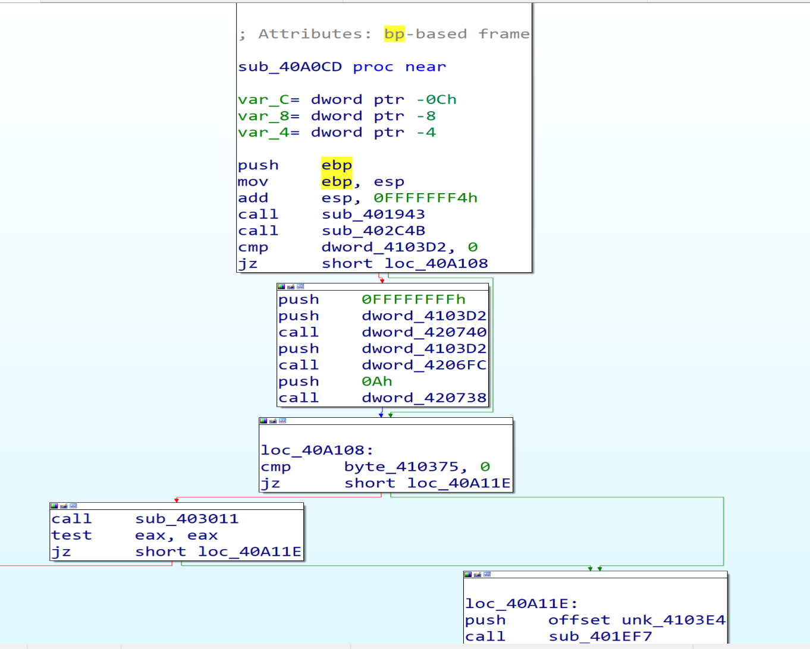

So, I will dump the file with X32 debugger using Scylla Plugin to get malware IAT table and start to analyze it again with IDA.


After loading the sample into X32 debugger we will see that the first function doing some calculation, but I can’t understand their functionality.


By getting in the second function, we can understand what it does by looking at the documentation of `PEB` and debug it to see the values to make sure from our static analysis that we made it above.

### Resolving Windows APIs at Run Time

---
Third function has a lot of details and calls so, we will dive in it.

After getting in the first function calls in it we will see that the function `401820` calls Twice and function `4018D9` calls many times.

Inside the function `401820` we will see the `PEB Structure` again.


But now malware will get some information from offsets `0Ch`, `2Ch`. and we can get information about those offsets from this
 [Article](https://www.geoffchappell.com/studies/windows/km/ntoskrnl/inc/api/pebteb/peb/index.htm)

 0Ch >= `PEB_LDR_DATA`

- The `PEB_LDR_DATA` structure is a Windows Operating System structure that contains information about all of the loaded modules in the current process,  It’s essentially the head of a doubly-linked list, and each item in the list points to an LDR_DATA_TABLE_ENTRY structure, which represents a loaded module. The InMemoryOrderModuleList field within PEB_LDR_DATA holds this list of loaded modules, Which contains all information about each module in process memory.

2Ch >= `KernelCallbackTable`

- malware can replace legitimate callback functions with malicious ones.

---

Malware author made an hashing algorithm that is private to him to all APIs and libraries  and he stored the hashes of APIs and libraries that he needs to import in local variable like `[ebp+8]` , and will compare them  with the hashes of all libraries and APIs , and if the two hashes are equal, he will put the address of this API or DLL in a particular `dword` to be ready to call it after this.

Malware firstly will go to `ntdll.dll` then `kernel32.dll` to reach to their exports table and then search about the names of functions that he need then he will take their addresses and store them in the dwords to start call them as API’s (Malware Resolving API’s at runtime).

In next figure malware will compare `ntdll.dll` hash with his own hash but it will not be matched so, the jump will be taken and he will exit from this function searching for another library to get the function he need from it.


Now malware will compare the hash of `kernel32.dll` with his own hash and will be match to each other so, the jump will not be taken, and he will start to call the functions that he needs from it.


then malware will dive into `Kernel32.dll` and starting to search about the functions he need by comparing hashes, in this figure malware will compare the hash of the first function in kernel32 called `AcquireSRWLockExclusive` and it will not be matched so, he will loop on all imports in KERNEL32 to get the target API.


And if we put a breakpoint after this jump  `jne darkside_ransomware.4018B3` we will see that the malware will get `LoadLibraryA`.

The second API malware will get it from `KERNEL32` is `GetProcAddress`.

So, by using `LoadLibraryA` and `GetProcAddress` malware can resolve any Windows API Function.


Inside the second function `4018D9` Malware will start resolving APIs that he need and put it in `dwords` by calling `LoadLibraryA` and `GetProcAddress`.


And we can make a conditional break point in the function makes resolve APIs and we can see the log after this, and next figure shows some of them.


We can see APIs like `RtlAllocateHeap`,    `SetFileAttrrebutesW`, `LookupAccountSidW`, `GetDC`, `CreateFontW`, `CoInitialize`, etc


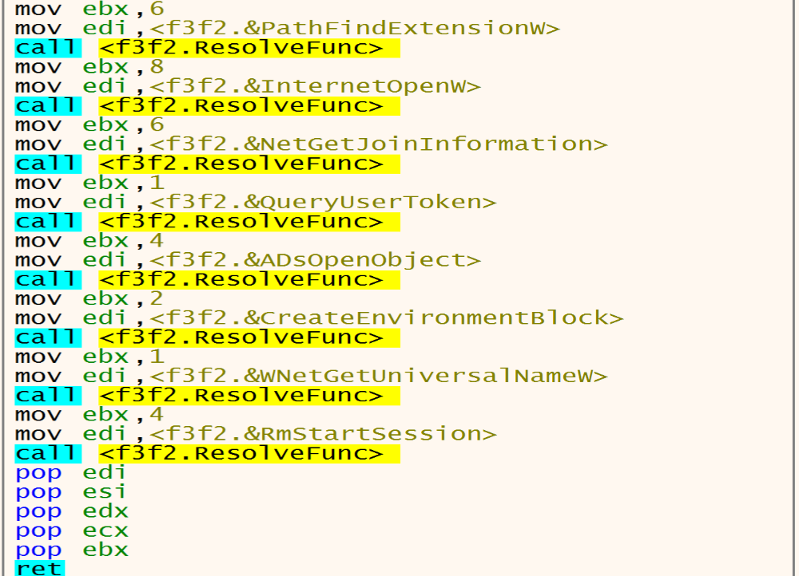

### Configuration Decrypting

After resolving the APIs, malware will get in the next function at Address `00402C4B` and will start decoding the data written in the Allocated heap. 


after decoding the data that is written in the heap I found many directories, files, Extensions and services, Malware listed this data to avoid it during the encryption process.

#### Directories to be avoided during the encryption process


#### Files to be avoided during the encryption process


#### Extensions to be avoided during the encryption process


#### Files to be deleted


Files have the `backup` name malware will delete it.

#### Processes to be avoided during the encryption process


#### Processes to be killed before encryption process


#### services to be stopped and deleteed


#### C2 Servers


#### Desktop Background Message


#### Content Of The Ransom README File


### Determine The System Default UI Language

Malware trying to detect our system’s installed and default language by calling `ZwQueryInstallUILanguage` and `ZwQueryDefaultUILanguage`.

Then he will compare the letters of system’s default language with the letters of Russian language and if the language not Russian malware will keep going in his malicious activity.

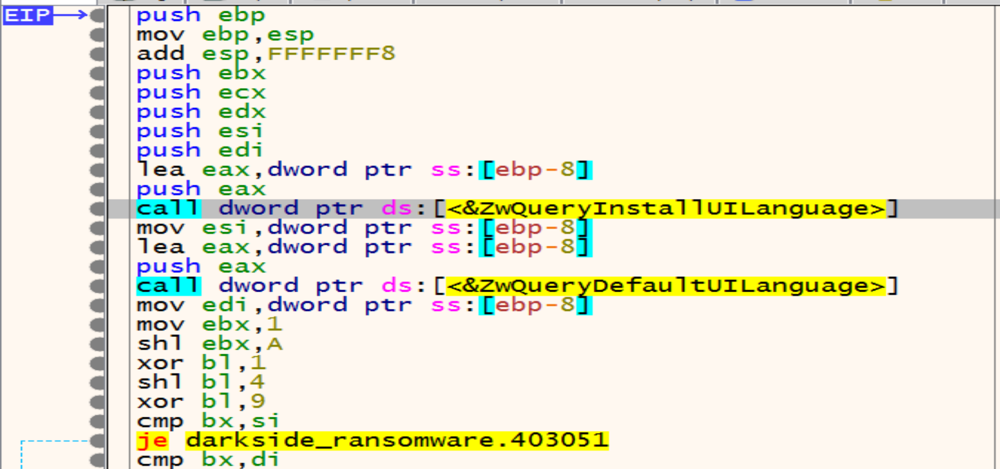

### Generate Ransomware Extension

Malware calls `RtlAllocateHeap` API to allocate memory heap to store something encrypted in it.


By getting in the next function we will see that the malware will decrypt the encrypted string that he stored it in the memory heap above `SOFTWARE\Microsoft\Cryptography`.


then malware will try to open the Registry key called `SOFTWARE\Microsoft\Cryptography` by calling `RegCreateKeyExW`.


Malware will allocate memory and decrypt another string `MachineGuid` so, we will make a conditional break point at return function to store all the decrypted strings in the log to be easy to us.


After opening the Registry malware will get the `MachineGuid` from it by calling `RegQueryvalueExW` API.

`memcpy` has two arguments Destinstion and the source in this figure the Unique Identifier(Guid) has been sent from the register `Eax` to `[ebp+8]` and the result will be "93278b6e-93a3-40e1-bfb7-b6dfda52ac11"

- MachineGuid is an identifier stored in the Windows registry. It’s generated during Windows installation and is unique to each machine. we can retrieve it from the registry using the path: HKEY_LOCAL_MACHINE\SOFTWARE\Microsoft\Cryptography\MachineGuid


then he will make a lot of calculation on Guid to get somthing.


Malware wants to get the result with only 8 in hex so, After a lot of calculation on Guid now we have the Extension of this Ransomware `.cdbb3152`.


The extension of encrypted files that are generated by this malware will be change dynamically based on the victim machine GUID.

### Privilege Escalation (UAC Bypass)

Then malware will get in function called `00401F8A` and inside it we will see that is calls `SHTestTokenMembership` by pushing two arguments `(220,0)`, we can know some details about this function from MSDN [SHTestTokenMembership](https://learn.microsoft.com/en-us/windows/win32/api/shellapi/nf-shellapi-shtesttokenmembership) this function Uses `CheckTokenMembership` to test whether the given token is a member of the local group with the specified RID, and we can read about it from here [CheckTokenMembership](https://learn.microsoft.com/en-us/windows/win32/api/securitybaseapi/nf-securitybaseapi-checktokenmembership)

So, malware uses SHTestTokenMembership API to verify if the user belongs to the Administrators groups (0x220 = 544 in decimal)

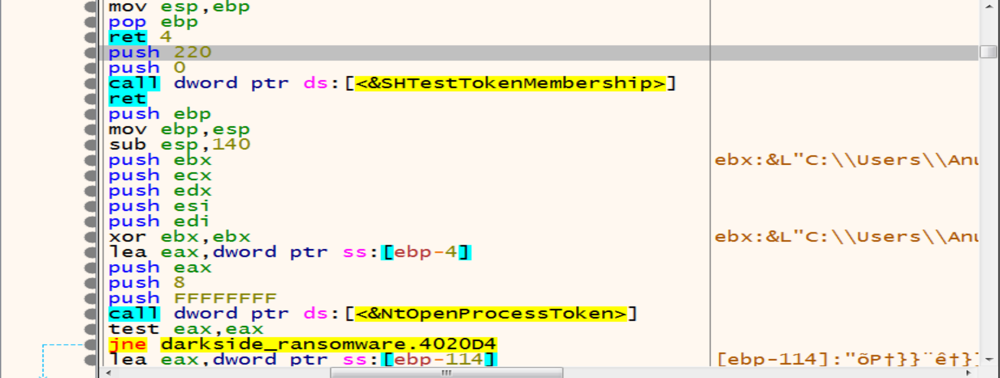

Then malware starting to check if you are an admin or not if you are not `EAX` will be `0` else `EAX` will be `1`

so, if we are not an admins in our system malware will get in the next function to Escalate his Privilege and bypass UAC to be an admin.

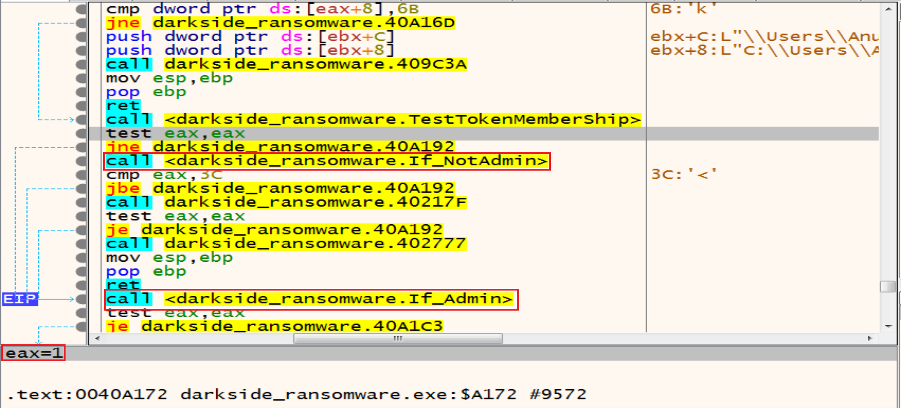

So, lets look at the function called `If_NotAdmin` to see what it do.


Malware trying to get information from PEB by offsets:

A4 => `OSMajorVersion`

A8 => `OSMinorVersion`

Together, they provide information about the Windows version running the process so, Malware will continue his checks to see if you are an admin or not by get in the next function.

`NtOpenProcessToken` allows malware to open an access token associated with a process, while `ZwQueryInformationToken` retrieves specific information about an access token. Both functions are essential for working with security tokens in Windows applications and drivers.
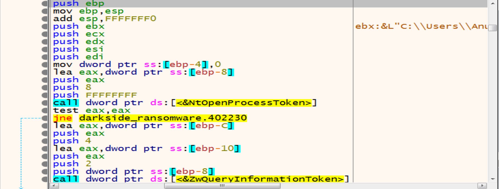

Malware will initialize `COM` Object to achieve persistence and Escalate his Privilege on our Windows systems.

Then malware will allocate memory and decrypt a string in it called `C:\\Windows\\System32`


Then malware will make some calculation on the encrypted text to decrypt it to be as `dllhost.exe`

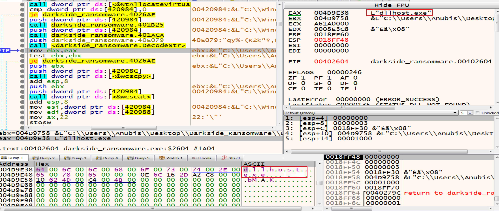

By using functions like `wcscpy` and `wcscat` malware trying to copy one wide character string to another and It takes two arguments  the destination buffer (dest) and the source string (src).

So, it will copy the `dllhost.exe` to the path that we are decrypted like this `C:\\Windows\\System32\\dllhost.exe`

Malware will run `dllhost.exe` as admin then `dllhost.exe` will run our malware again with higher privilege as admin.


After this malware will decrypt two strings:

- `Elevation:Administrator!new:`
- `{3E5FC7F9-9A51-4367-9063-A120244FBEC7}`  if we search about it we will find that is associated with a COM interface-object used for UAC (User Account Control) bypass. Several ransomware families exploit this technique to elevate their privileges and perform malicious actions without triggering UAC prompts.

And it will be as this: `Elevation:Administrator!new{3E5FC7F9-9A51-4367-9063-A120244FBEC7}` after calling the two functions wcscpy and wcscat

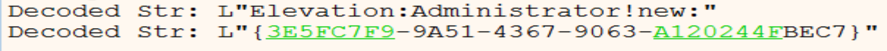

After this malware will call function called `ObjectStublessClient9` to launch a new process with higher privilege as admin.


- with Dr Bahaa at Mahara Tech help I will continue debugging the new sample with patching the file `OEP` with relative `JMP` to be avoided debugger escaping from me.

After launching the new sample, debugger will stop at `TestTokenMemberShip` function wait us to start debugging it, we will reach to the function called `LookupAccountSid` and it functionality is determining the account name and discover the domain where an account resides, malware usnig this function can impersonate legitimate users by obtaining their account names.
It can then perform actions (accessing files, running processes) with the same privileges as those users.

Malware now will decrypt strings like `NT AUTHORITY`, `AUTORITE NT`, `NT-AUTORITÄT` then will compare them with my account name by api `_wcsicmp` to see if I have a higher privilege or not.

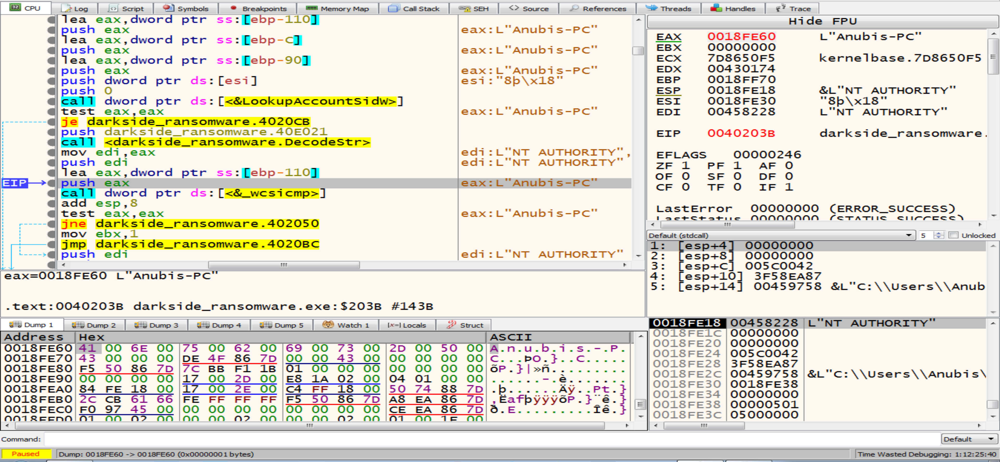

Then malware will call `OpenSCManager`, with this function he can control with any service in our machine because he has a higher privilege in our system now.

Malware look for a sevice called `.cdbb3152` but he will not find it so, he will close this service handle.


Then malware will open `OpenSCManager` again and will call `create service` that is take arguments like path of the Executable and service has the same name of the Extension to be ready to start the service called `.cdbb3152`.

After this, the elevated process will exit so, we will make an analysis to a new sample that created with higher privilege more than admin that is works as a sevice with `NT AUTHORITY\SYSTEM` privilege.

After this we will notice that the malware will call a suspicious function at address `0040A164` so, we will dive in it to see what it does.


Malware will allocate a space in the memory to put his encrypted data and will decrypt it using his algorithm as we can see it in Ida Pro, we will see the name of the his private file named `"README.1a7cfdf5.TXT"` in which he tells us that our files have been encrypted and in which he asks us for ransom and how to pay it.


`OpenWindowStation` access the interactive window station `Winsta0`, Window stations are used to isolate processes and manage their interaction with our desktop

Malware might open a window station with higher privileges using `OpenWindowStation`. Then, it could modify security settings using `NtSetSecurityObject` to gain additional permissions.


Then malware will call `OpenDesktop` that is utilized to open the `Default` desktop to open a desktop within the window station. This allows interaction with user interface elements, such as creating windows or injecting code into existing processes.


Then malware will try to open a mutex named `Global\\bd1869edd337179f75349114fce8afbb` which makes sure that there is only one instance of the ransomware running in this system and if the mutex already exists the malware quits, and if not exist he will create it.


Now malware will create a mutex with the name in the figure because after his search he didn’t find mutex with this name.


Then malware will create a new thread using `CreateThread` API, and we will talk about the thread activity in the end.


 

After this we can see that the malware will call `GetLogicalDriveStrings` to identify available drives in our machine.


then malware will call `GetDriveType` to determine the type of a specified drive (fixed, removable). by comparing the return value, DRIVE_REMOVABLE (0x2) and DRIVE_FIXED (0x3) drives.


And if the Drive is Fixed(0x3) malware will dive into the next function that is calls `FindFirstFileExW` from it.


Malware using this API `FindFirstFileExW` will search about if this drive has a `$Recycle.Bin` directory or not and if he has, he will delete something from it


The Malware will get a folder called `S-1-5-18` from `$Recycle.Bin` then will delete this folder using `RemoveDirectory`. 


Then malware will get a folder called `C:\\$Recycle.Bin\\S-1-5-21-813629363-933097851-2939675062-1000` and will delete it too using `RemoveDirectory`.


Then malware will get the file `$I0W4J3P.xml` from `$Recycle.Bin\\S-1-5-21-813629363-933097851-2939675062-1001\\$I0W4J3P.xml` and will delete it use `DeleteFile`.


#### Files that the malware will delete it from `$Recycle.Bin\\S-1-5-21-813629363-933097851-2939675062-1001\\`

````
$I0W4J3P.xml

$I4U6WTE.7z

$IH5ZP36.zip

$IMXO8YU.7z

$INVI2RQ.lnk

$R0W4J3P.xml

$R4U6WTE.7z

$RH5ZP36.zip

$RMXO8YU.7z

$RNVI2RQ.lnk

desktop.ini
````

Then in the next function, malware will initialize the COM object for `bcryptprimitives.dll` that is handles tasks like encryption, hashing, and key generation so, the malware will use it to perform cryptographic operations, such as encrypting or decrypting sensitive data.

And `iertutil.dll` that is related to Internet Explorer, Malware can inject malicious code into IE processes may be to send all of our data to the attacker C2 Server as a Internet Explorer to bypass Network security like fire walls or another defence systems.


Then malware will use  COM objects like `CoCreateInstance` and WMI commands to delete volume shadow copies.


Then malware will call the ConnectServer API to connect to the local `ROOT\CIMV2`, malware may be use WMI to execute commands remotely on other machines within the same network.
By connecting to the “ROOT\CIMV2” namespace, they can execute WMI methods on remote systems.


Then malware will call `CoSetProxyBlanket`, malware author  may be he use this technique to execute malicious code while evading detection.

Malware assigns specific values to these parameters (0xA, 0x3, and 0x3). `0xA` corresponds to `RPC_C_AUTHN_WINNT` (NTLMSSP), `0x3` corresponds to `RPC_C_AUTHN_LEVEL_CALL`, and `0x3` corresponds to `RPC_C_IMP_LEVEL_IMPERSONATE12`. These values determine how the proxy handles authentication and authorization during remote procedure calls.


After this malware will query all shadow copies in the system using `Win32_ShadowCopy.ID='%s'` then will delete all of Shadow Copies using `Win32_ShadowCopy`.


Then malware will call `EnumServicesStatusEx` to identify and list the services running on a system and their status status by retrieving it by this function `0x3 = SERVICE_STATE_ALL` and `0x30 = SERVICE_WIN32`, he will loop on the services to choose the target one.


The malware will open the targeted services by calling the `OpenServiceW`.


Then he will stop and delete them one after one using `ControlService` and `DeleteService`.


Malware will call `FindFirstVolumeW` that retrieves the names of a volumes on a computer. then he will get the retrieved volumes path name with `GetVolumePathNamesForVolumeName`.


Then malware will call `GetLogicalDriveStrings` to get all Logical Drives.


Malware use `GetModuleFileName` to Retrieve the full path of the executable file and `PathQuoteSpaces` to add a quotation marks around a path then he will use `GetProcessId` to Retrieve the process identifier malware use it to interact with specific processes.


Malware uses `CreateFileMapping` to create a handle to a file mapping with name `Local\\jobs-3420`, which loads this file into memory and makes it accessible via memory addresses.

Malware needs to load its code into memory to execute.
By using these functions, malware can bring its code into memory, making it accessible for execution.


Then malware will call `CreateEvent` to create an event then he will add it to the file path and it will be as this: 

> C:\\Users\\moham\\Desktop\\DarkSide_Ransomware\\f3f2_p.exe -work worker0 job0-3420

The `-work` flag might indicate a task or operation, while `worker0` and `job0-3420` could refer to worker IDs or job numbers.

It can check whether the event already exists or create a new one, if the event already exists, the malware can exit silently, avoiding duplicate execution. If not, it proceeds to execute its malicious code.


Then malware will create this process using `CreateProcess`.


And then malware will use `CreateFile` to create file called `1a7cfdf5.ico` then malware will call `WriteFile` function from the Kernel32.dll library to write the file in `ProgramData`.


And after this malware will use `RegCreateKeyEx` to create a registry key called `1a7cfdf5`


then he will call the `SHChangeNotify` to notify the shell to update its icon and set it as a `DefaultIcon`.


Then he will create a registry key:
> S-1-5-21-813629363-933097851-2939675062-1001\Control Panel\Desktop

in `Computer\HKEY_USERS` and will update the Desktop Wallpaper with the attacker wallpaper.


#### Thread Activity

Malware will decrypt some strings like:


And then he will open the registry called `SOFTWARE\\Microsoft\\Windows NT\\CurrentVersion` using `RegCreateKeyEx`.


then he will use `RegQueryValueEx` to query the `ProductName` to extract product name of Windows and will use `ProductId` to extract he Windows product ID.


Then malware will allocate a memory heap to put the extracted data from our machine in it.


Then the data will be encrypted by specific encryption algorithm related with the malware author.


Finally, malware will encode the previous data with Base64 to be ready to send it to the attacker C2 Sever.


Then malware will call `InternetOpen` that it takes decrypted UserAgent as an argument.


Malware will send the POST request to the C2 server using `HttpSendRequestW`.

 

By looking at the stack and `fakedns` we can see the packets that will be send to the  `baroquetees.com` (Attacker C2 Server) 

 


## Conclusion

Darkside Ransomware starts his privilege as user then as admin and finally he will escalate his privilege to be as system by run his extension as service to achieve persistence.

Malware uses a combination of symmetric (SALSA20) and asymmetric (RSA-1024) encryption algorithms to encrypt the files and exfiltrates sensitive data from compromised systems. Malware check the system language and avoiding encrypting Russian language machines, delete Shadow copies, delete folders from Recycle Bin.

## IOCs

| File Hash | F3F25AF554BEDFA4EE2824BB858280282BD87828D446048619DC49FE061741B4 |
| C2 | baroquetees.com |
| C2 | rumahsia.com |
| User-Agent | Mozilla/5.0 (Windows NT 6.1; Win64; x64; rv:79.0) Gecko/20100101 Firefox/80.0 |

