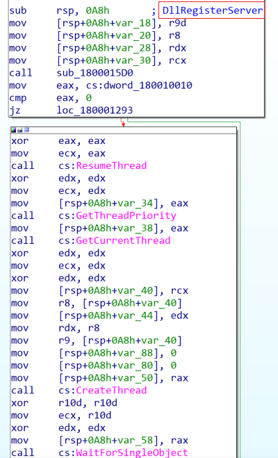
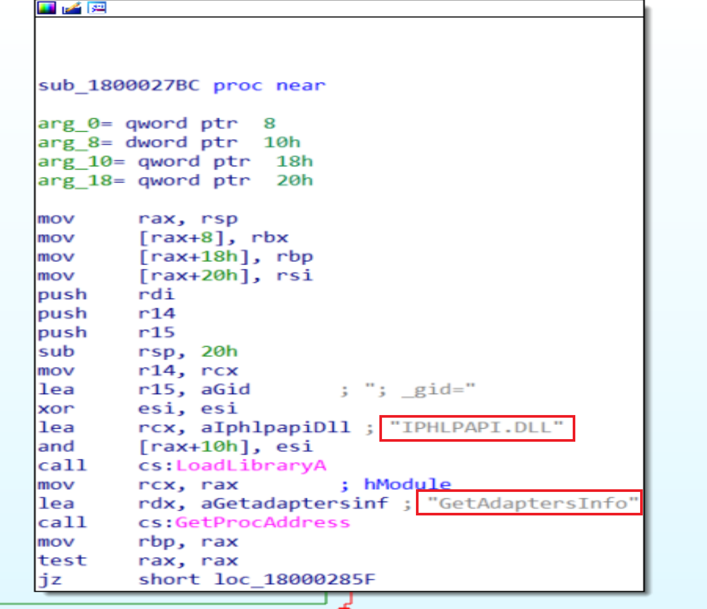
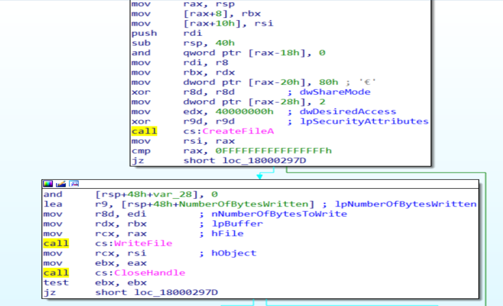

# IcedID Analysis


## Summarys

IcedID is a banking trojan-type malware which allows attackers to utilize it to steal banking credentials of the victims. IcedID aka BokBot mainly targets businesses and steals payment information, it also acts as a loader and can deliver another viruses or download additional modules.

## Loader.exe Analysis

### Basic Analysis

File SHA-256 Hash is:
> 33CC3816F98FA22354559711326A5CE1352D819C180BE4328A72618D20A78632


Using `Virus total` we will find 52/71 security vendors and 2 sandboxes flagged this file as malicious.

#### SandBox Results

----

File type:

- Win32 DLL

Exports:

- DfcidmAgqxxIybvoovbd
- DllGetClassObject
- DllRegisterServer
- FbyouxodmaAmblxtzonyr
- GhjrgreaggXyoydphfea
- NrmqrpckejMlzraxTtfncwsvfmhs
- PluginInit


Using `Die` we will notice the sample is not Packed.


File is compiled at 2021/07/06  Tue 07:53:01 UTC


Using `PE-bear` we will find 1 library called `KERNEL32.dll` and ther is 6 imports calling from it like:

- GetThreadPriority
- GetCurrentThread
- CreateThread
- WaitForSingleObject
- DuplicateHandle
- ResumeThread


### Advanced Analysis

----


If we look at the main function we will not find any thing suspicious



So, we will look at the exports but some of them doesn't make any thing too except `DllRegisterServer` it calls a lot of API'S and functions


After start debugging we will reach to the function called `VirtualAlloc` that it will be ready to be full with some thing suspicious so, we will go to the return function waiting the result.


And here it is our memory dump is full with data starting with `MZ` so, we have a new `PE` file lets start to make an analysis to it.

## Dropped1.exe Analysis

### Basic Analysis

----

File SHA-256 Hash is:
> 9FF5C9CE0D1536CE8B043B10758453E3349A82CC31195CA57250A272E65B4DA4


- 52/69 security vendors and 1 sandbox flagged this file as malicious


- Using `CFF Explorer` we will find 6 libraries and a lot of imports called from them.


- Using `Die` we will notice that the Entropy is very high but the file is not packed, this may indicate to the Encryption methods is a lot.

### Advanced Analysis

---


Thread starting Address at `00000001800015B4` we will follow this address in X64 debugger.


We will see functions as `sleep` and `rdtsc` malware author maybe using them to bypass Sandboxes and detect debuggers we can pass them because they will waste our time.


Malware will get in a loop to decrypt some thing and in the end of the loop it will compare register r8 20 times to get out from it.


So, by get in the loop and follow the memory address in Dump we will find string that may be the attacker host `revedanstvy.bid`.


Malware author put a legitimate website may be to get us lost and distracted or to bypass firewalls.


Malware try to Make us confused and trying to disapper by sending the information to C2 server under `gads` >> `Google ads` or any words related with google to bypass firewalls or others related with network.

Malware will call `RtAllocateHeap` to empty a place in the memory heap then will call `wsprintfW` to print the process information in it.


Malware get information about `GetTickCount64` and will add it to the cookies by call `wsprintfW`.


Then malware will load `NTDLL.dll` to get process Address of `ZwQuerySystemInformation` from it by calling `GetProcAddress` to get our  system informations.


Then Malware will call `RtlGetVersion` to know the windows version and build generation.


Now he get information about our CPU type and another information and will put them in the memory.


From `Kernel32` malware will import functions called `GetComputerNameExA` and `GetUserNameA` to get some information about the computer and the user.


Malware will Load `Kernel32.DLL` get process address of `GetNativeSystemInfo` ready to calling  it to get some information about the system.


After this Malware will call `IPHLPAPI.DLL` Library and will import  function called `GetAdaptersInfo` from it to retrieves adapter information for the local computer, GetAdaptersInfo function can retrieve information only for IPv4 addresses.


Then Malware will call functions like `CreateFileA`, `WriteFileA` to make a file and write all the extracted data in it to send all of them to the C2 Server(Attacker Server) by using functions like:

- `WinHttpSendRequest`
- `WinHttpQueryOption`
- `WinHttpSetOption`
- `WinHttpQueryDataAvailable`
- `WinHttpReadData`
- `WinHttpReceiveResponse`
- `WinHttpQueryHeaders`
- `WinHttpConnect`
- `WinHttpCloseHandle`
- `WinHttpOpen`
- `WinHttpOpenRequest`
- `WinHttpSetStatusCallback`

Those functions Imported from `WINHTTP.dll` and the file may be disappear as a "Google ads" or under a legitimated site like "Amazon.com" to bypass firewalls or any protection technique across the Network.

## Dropped2.exe Analysis

File SHA-256 Hash is:
> 41A6F3C590EA10C7E3D3D9B31DBCB0F0477AA39E2E4948B2B5619961A7708295


- Using  `Die` We will notice that the Entropy is very low that indicates to that the file is not packed.


- File Compiled at 2021/06/09 Wed 14: 10: 13 UTC
- No security vendors or sandboxes have flagged this file as malicious.


- File hasn’t any Imports or Exports it has three functions doing some Calculation and I performed basic analysis on this binary and I found that it’s very similar to the first binary so we can ignore it.

## Conclusion

“Initially, a binary file drops two DLLs onto the system. These DLLs engage in legitimate traffic to `aws.amazon.com`, effectively deceiving the firewall. Subsequently, the malware resolves the attacker’s domain and collects information about the user and machine. To mask this activity, the malware encodes the data into cookies, converting ASCII details (such as the computer name) into numeric representations. Finally, it transmits all gathered information to the C2C server, retrieves content from there, and writes it to a file.”


## IOCs

| C2 | revedanstvy.bid |
| Loader.exe SHA-256   | 33CC3816F98FA22354559711326A5CE1352D819C180BE4328A72618D20A78632                |
| Dropped1.exe SHA-256    |  9FF5C9CE0D1536CE8B043B10758453E3349A82CC31195CA57250A272E65B4DA4             |
| Dropped2.exe SHA-256   | 41A6F3C590EA10C7E3D3D9B31DBCB0F0477AA39E2E4948B2B5619961A770829
| Url | http://ocsp.comodoca.com0 |
| Url | http://ocsp.sectigo.com0 |
| Url | https://sectigo.com/CPS0 |
| Network | ; _ga= |
| Network | Cookie: _s= |
| Network | o; _gid= |
| Network | aws.amazon.com |
| Network | POST |
| Network | Cookie: __gads= |
| Registry | DllRegisterServer |
| Process | ResumeThread |

## Yara Rules

```

rule IcedID
{
    meta:
    description = "Detects IcedID Malware"
    author = "Mohamed Bakr"
    date =  "2024-5-6"
    strings:
    $string1 = "NrmqrpckejMlzraxTtfncwsvfmhs"
    $string2 = "DfcidmAgqxxIybvoovbd"
    $string3 = "DllGetClassObject"
    $string4 = "DllRegisterServer"
    $string5 = "FbyouxodmaAmblxtzonyr"
    $string6 = "GhjrgreaggXyoydphfea"
    $string7 = "PluginInit"
    condition:
    any of them 

}

```
